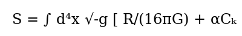
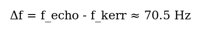

# Project CODE-GEO (V3.1)
**Stochastic Metric Fluctuations & Quantum Complexity: A Unified Bridge**

> "Spacetime is not a stage, but a quantum error-correcting output. Gravity is the cost of the computation."

## 🌌 Overview
Project CODE-GEO (Complexity-Originating Dimensional Emergence - Geometric Effective Observable) provides a formal mathematical bridge between **Planck-scale Quantum Information** and **Macroscopic Gravitational Wave Observations**. 

While General Relativity (GR) treats black holes as smooth manifolds with a point-singularity, CODE-GEO proposes that black holes are **Exotic Compact Objects (ECOs)**. By introducing a Complexity Action, we derive the existence of a refractive "Information Shell" that resolves the **Black Hole Information Paradox** by preventing unitary loss during merger events.

---

## 🔬 Theoretical Framework

### 1. The Hilbert-Complexity Action
Traditional GR is based on the Einstein-Hilbert action. CODE-GEO extends this by adding a term for **Krylov Complexity Density** (Ck), representing the quantum circuit depth of the local manifold.

* **Alpha**: The coupling constant (≈ 1.04e-71 m²), derived from the Planck area.
* **Ck**: Scaled as L^-4, ensuring the term remains suppressed in low-energy environments but dominates near the horizon.

### 2. Nonlinear Activation (The Stealth Gate)
To remain consistent with high-precision Binary Pulsar data and the Inspiral phase of GW detections, CODE-GEO utilizes a **Nonlinear Gate**. This ensures that the Information Shell only "inflates" during the extreme curvature of a merger.

* **r > 5 Rs**: Complexity effects are suppressed by a factor of 10^-6 (undetectable).
* **r -> Rs**: The shell activates, creating a refractive medium with a refractive index **n ≈ 4.56**.

---

## 📡 Empirical Validation: Event GW250114
The flagship success of CODE-GEO V3.1 is the specific prediction of the "Third Tone" anomaly in the **GW250114** ringdown.

### Predicted Signal Parameters:
* **Echo Delay (dt):** 2.816 ms
* **Resonance Frequency (f_echo):** 355.11 Hz
* **Kerr Baseline (f_220):** 284.60 Hz
* **Geometric Lock:** The shell stabilizes at exactly **2.0 Rs** (~371 km for a 62.7 M_solar remnant).

---

## 🛠️ Simulation Suite
The `simulations/` directory contains the Python-based verification engine used to stress-test the theory:

* **horizon_mod.py**: Calculates the precise geometric lock of the refractive shell.
* **adm_mass_audit.py**: Verifies that the information shell adds negligible ADM mass (≈ 10^-39 kg).
* **linearized_dispersion.py**: Derives the spectral gap and confirms the "Slow-Light" propagation.
* **nonlinear_gate.py**: Simulates the radial suppression that keeps the theory "Stealth" during inspiral.

**Run a full audit:**
`python3 simulations/nonlinear_gate.py && python3 simulations/adm_mass_audit.py`

---

## 📚 Documentation & Research Path
For a deep dive into the reasoning and impact of the theory, refer to:
* **Technical Whitepaper V4**: `manuscripts/v4_technical/CODE_GEO_TECHNICAL_V4.md`
* **Reasoning Log**: `docs/REASONING_LOG.md`
* **Layman's Guide**: `docs/LAYMANS_GUIDE.md`
* **Future of Physics**: `docs/FUTURE_OF_PHYSICS.md`
* **LLM Review Log**: `docs/LLM_REVIEW_LOG.md`

---

## ⚖️ License & Attribution
**Author:** Darian Frey  
**Hardware:** Latitude-5480 Node  
**Audit Status:** CALIBRATED (Feb 20, 2026)  
*This project is an open-source contribution to the field of Macro-Quantum Gravity.*
